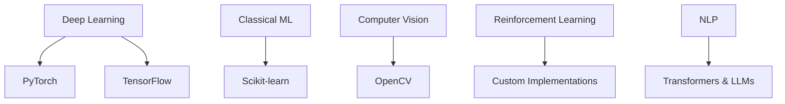

<div align="center">
  
```ascii
██████╗ ██████╗ ███████╗███████╗████████╗██╗███████╗██╗  ██╗
██╔══██╗██╔══██╗██╔════╝██╔════╝╚══██╔══╝██║██╔════╝██║  ██║
██████╔╝██████╔╝█████╗  █████╗     ██║   ██║███████╗███████║
██╔═══╝ ██╔══██╗██╔══╝  ██╔══╝     ██║   ██║╚════██║██╔══██║
██║     ██║  ██║███████╗███████╗   ██║   ██║███████║██║  ██║
╚═╝     ╚═╝  ╚═╝╚══════╝╚══════╝   ╚═╝   ╚═╝╚══════╝╚═╝  ╚═╝
```


</div>

---

<div align="center">
  
### 🌟 **`System.out.println("Hello, World!");`** 🌟

</div>

```python
class PreetishMajumdar:
    def __init__(self):
        self.name = "Preetish Majumdar"
        self.role = "Data Engineer & AI Researcher"
        self.education = "Final Year CSE @ SRM University"
        self.location = "Chennai, India (Originally from Nagpur)"
        self.philosophy = "Learn → Build → Iterate → Evolve"
        self.current_focus = [
            "Career Technology Solutions",
            "Generative AI Applications", 
            "AI-Driven Educational Tools",
            "Reinforcement Learning Systems"
        ]
        self.passion_project = "Career Compass - AI Career Development Platform"
        
    def get_daily_routine(self):
        return {
            "morning": "☕ Coffee + Algorithm Analysis",
            "afternoon": "💻 Deep Learning & System Design",
            "evening": "🎹 Piano + Music Production",
            "night": "🚀 Open Source Contributions"
        }
    
    def execute_mission(self):
        while True:
            self.learn_new_technologies()
            self.build_innovative_solutions()
            self.bridge_education_employment_gap()
            self.contribute_to_ai_future()
```

---

<div align="center">

## 🛠️ **Technology Arsenal** 

<details>
<summary>🔥 <b>Core Programming Languages</b></summary>
<br>

```yaml
languages:
  python:
    proficiency: "Expert"
    use_cases: ["AI/ML", "Data Engineering", "Backend Development"]
    frameworks: ["PyTorch", "TensorFlow", "FastAPI", "Flask"]
  
  java:
    proficiency: "Advanced"
    use_cases: ["Enterprise Applications", "Spring Framework"]
    specialization: "Backend Systems Architecture"
  
  c:
    proficiency: "Intermediate"
    use_cases: ["System Programming", "Performance Optimization"]
    focus: "Low-level Operations & Memory Management"
```

<p>
  
  
  
</p>

</details>

<details>
<summary>🤖 <b>AI & Machine Learning Stack</b></summary>
<br>



<p>
  
  
  
  
</p>

</details>

<details>
<summary>🗄️ <b>Database & Big Data Engineering</b></summary>
<br>

```sql
-- Database Expertise Spectrum
SELECT 
    database_type,
    proficiency_level,
    use_cases,
    performance_optimization
FROM technical_skills 
WHERE domain = 'Data Engineering'
ORDER BY complexity DESC;

/*
Results:
PostgreSQL    | Expert     | OLTP, Analytics    | Query Optimization
MySQL         | Advanced   | Web Applications   | Index Tuning  
Oracle DB     | Intermediate| Enterprise Systems | PL/SQL Procedures
MS SQL Server | Intermediate| Business Intelligence| SSIS/SSRS
Apache Spark  | Advanced   | Big Data Processing| RDD/DataFrame API
*/
```

<p>
  
  
  
  
</p>

</details>

<details>
<summary>🏗️ <b>Frameworks & Development Tools</b></summary>
<br>

```javascript
const technicalStack = {
    backend: {
        frameworks: ["FastAPI", "Flask", "Spring Boot"],
        architecture: "Microservices & RESTful APIs",
        deployment: "Docker & Cloud Services"
    },
    dataScience: {
        analysis: ["Pandas", "NumPy", "Matplotlib"],
        visualization: "Advanced Statistical Plotting",
        processing: "ETL Pipeline Development"
    },
    multimedia: {
        audio: "PyAudio - Digital Signal Processing",
        games: "PyGame - Interactive Application Development",
        cv: "OpenCV - Computer Vision Solutions"
    }
};
```

<p>
  
  
  
  
  
</p>

</details>

### 💡 **"The rest is just syntax..."** 💡

</div>

---

<div align="center">

## 📊 **Performance Analytics Dashboard**

<table>
<tr>
<td align="center" style="padding: 20px">

### 📈 **GitHub Statistics**


</td>
<td align="center" style="padding: 20px">

### 🎯 **Language Distribution**


</td>
</tr>
</table>

### 📋 **Contribution Metrics**


### 🏆 **Achievement Showcase**


</div>

---

<div align="center">

## 🌐 **Professional Network & Platforms**

<table>
<tr>
<td align="center" width="20%">

**💼 Professional**
<br><br>
<a href="https://www.linkedin.com/in/preetish-majumdar-75296b211/">
  
</a>

</td>
<td align="center" width="20%">

**📊 Data Science**
<br><br>
<a href="https://www.kaggle.com/preetishmajumdar">
  
</a>

</td>
<td align="center" width="20%">

**💻 Problem Solving**
<br><br>
<a href="https://leetcode.com/u/PreetishMajumdar/">
  
</a>

</td>
<td align="center" width="20%">

**🏅 Competitive**
<br><br>
<a href="https://www.hackerrank.com/profile/preetishmajumdar">
  
</a>

</td>
<td align="center" width="20%">

**📧 Contact**
<br><br>
<a href="mailto:preetishmajumdar@gmail.com">
  
</a>

</td>
</tr>
</table>

</div>

---

<div align="center">

## 🚀 **Current Mission: Career Compass**

```yaml
project_overview:
  name: "Career Compass"
  description: "AI-powered career development platform"
  mission: "Bridging the gap between education and employability"
  technologies:
    - Generative AI
    - Machine Learning
    - Natural Language Processing
    - Data Analytics
  impact: "Helping students unlock their potential through AI-driven insights"
```

### 🎯 **Professional Philosophy**
> *"In the intersection of artificial intelligence and human potential lies the future of education and career development."*

</div>

---

<div align="center">

## 📊 **Real-time Activity Feed**


</div>

---

<div align="center">

```python
if __name__ == "__main__":
    preetish = PreetishMajumdar()
    print("🚀 Ready to innovate, collaborate, and build the future!")
    print("💡 Let's connect and create something amazing together!")
```


---

*⚡ "Code is poetry, AI is the future, and together we're writing the next chapter of technology."*

</div>
